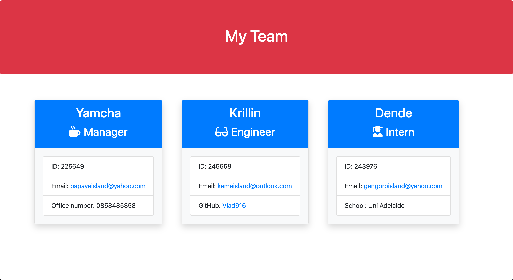

# Template Engine - Employee Summary

This is an application that allows the user to build a team profile/roster with one manager and any number or combination of interns and engineers, that will also display all the necessary information of each individual.

This program uses the inquirer package to get the values from a command line interface The answers are then stored in an array Based on the role provided for each entry, a new card is generated and the html is saved as a object in an array Once the user has completed entering team members the final HTML file is created

### Link for the deployed application: 

https://github.com/vlad916/Template-Engine

### Link for the Video (DEMO):

https://drive.google.com/file/d/1Y9iIFbXRQauPgRTYfWJ4QPS4GMT3QI2b/view?usp=sharing

___

___
## Instructions on how to use the application:

1. Clone the repository.

2. Open the `app.js` file in visual studio or any code editor of your choice.

3. Install all npm packages with `npm install`.

4. Run the app with `node app.js` in the terminal to start the CLI operation. 

5. Follow the onscreen prompts to enter all the team members and all the information needed. 

6. When finished, A generated `html page` is created that can be found in the `output` folder directory of the repo.

